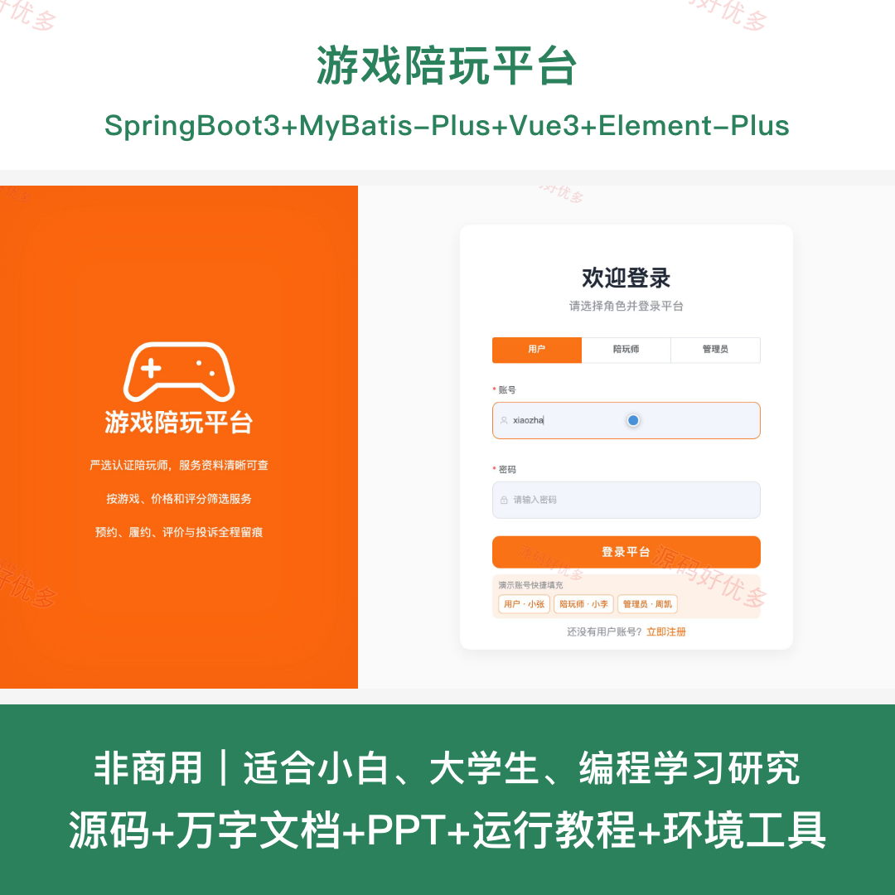
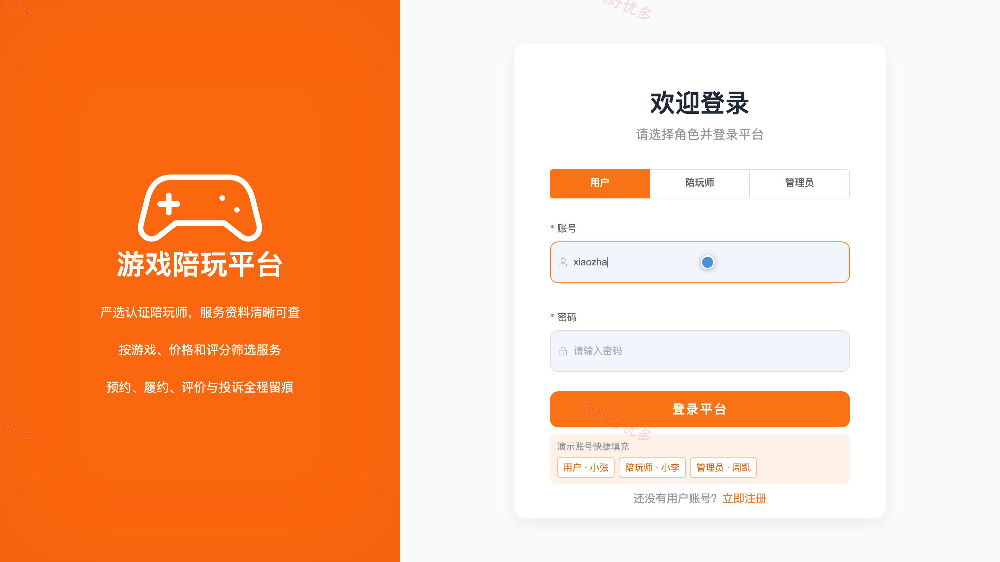
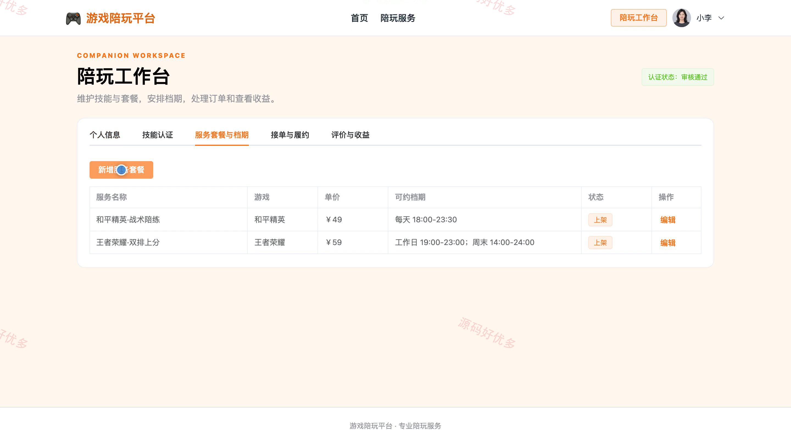
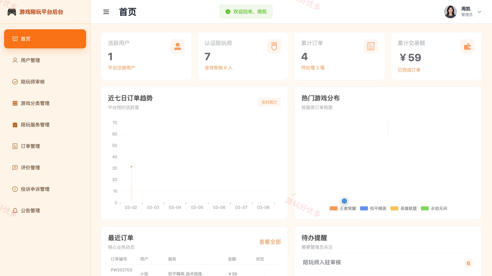
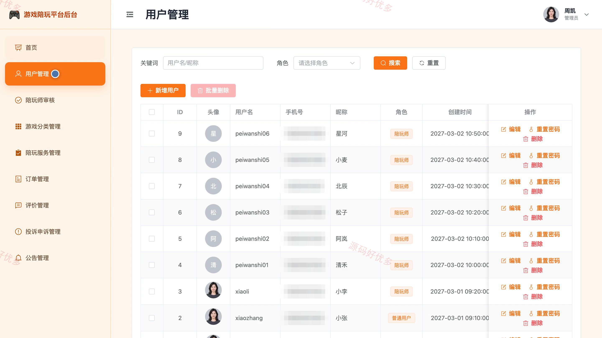

# bs100A
bs100A游戏陪玩平台
## 源码问题查看主页咨询

### 一、关键词
游戏陪玩、在线陪练、电竞陪练、陪玩预约、游戏社交服务

### 二、作品包含
源码+数据库+万字设计文档+PPT+全套环境和工具资源+本地部署教程

### 三、项目技术
前端技术： Html、Css、Js、Vue3.4、Element-Plus
后端技术：Java、SpringBoot3.2.0、MyBatis-Plus

### 四、运行环境（以下版本亲测，其他版本兼容性请自行测试）
开发工具：IDEA/eclipse + VSCODE

数据库：MySQL5.7+（共11张表）

数据库管理工具：Navicat10以上版本

环境配置软件： JDK17 + Maven

前端Nodejs：16+

浏览器：谷歌浏览器

### 五、项目介绍
项目编号：bs100A

游戏陪玩平台面向用户、陪玩师和管理员，围绕陪玩服务展示、预约下单、订单履约、评价反馈与平台治理构建协同流程，支持陪玩师维护服务套餐和档期，管理员完成资质审核、内容管理与运营统计。

角色：用户、陪玩师、管理员

用户功能：账号注册与登录、陪玩服务浏览筛选、服务详情查看、收藏陪玩服务、陪玩预约下单、订单查看与取消、完成服务后评价、投诉反馈。

陪玩师功能：入驻资料维护、游戏技能管理、服务套餐与上下架管理、可约档期管理、订单接单与拒单、服务履约状态更新、异常订单申诉、评价与收益查看。

管理员功能：用户管理、陪玩师审核、游戏分类管理、陪玩服务管理、全部订单管理、评价内容管理、投诉申诉处理、公告与数据统计。

### 六、运行截图

